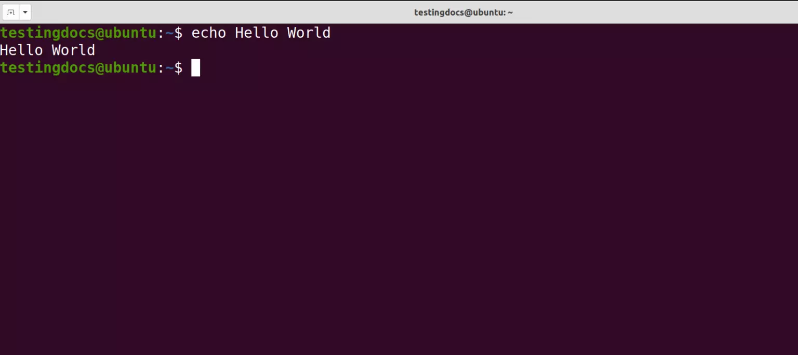

# Command Line Course Notes

This course introduced the fundamentals of working with the command line, Unix-based tools, scripting, version control, and deploying content online. Each week focused on building practical skills that are useful for everyday computing, programming, and managing projects.

---

## Week 1: Command Line Basics

**Main Content:**  
We learned to navigate and manipulate files and directories using the terminal. Key skills included:  

- Listing directory contents (`ls`) and changing directories (`cd`)  
- Creating, moving, copying, and deleting files and directories  
- Viewing text files (`less`) and editing files in a text editor  
- Changing file permissions  
- Visiting the root directory

**Example Commands:**

```bash
# List files in current directory
ls

# Create a new directory and move into it
mkdir directory_name
cd directory_name

# Copy a file
cp ~/Documents/example.txt .
```

**Reflection:**  
I now feel comfortable moving around the file system and performing basic operations efficiently in the command line.

---

## Week 2: Character Encodings & Text Processing

**Main Content:**  
We explored text processing and file formats, including:  

- Understanding ASCII, Latin-1, and UTF-8 encodings  
- Converting text files between encodings and formats  
- Counting lines, words, and characters; sorting and transforming text  
- Cutting and pasting columns in structured files  
- Using `grep` and `sed` for pattern searching and editing  
- Piping commands to create efficient workflows  

**Example Commands:**
```bash
# Convert a text file from Latin-1 to UTF-8
iconv -f ISO-8859-1 -t UTF-8 file_latin1.txt > file_utf8.txt

# Count lines, words, and characters
wc file_utf8.txt

# Extract all lines starting with uppercase letters
grep '^[A-Z]' file_utf8.txt

# Remove duplicate lines from a sorted file
sort file.txt | uniq > file_unique.txt
```

**Reflection:**  
I learned how to manipulate text files and automate workflows, which is essential for processing large datasets or preparing corpora for analysis.

---

## Week 3: Scripting and Environment Management

**Main Content:**  
We learned to write simple shell scripts and manage the environment:  

- Using command-line parameters, `if` statements, and command substitution  
- Viewing and setting environment variables, making permanent changes via `.bashrc` / `.bash_profile`  
- Using `sudo` to run commands as root, installing software (`apt-get`, `brew`, `pip`)  
- Creating Python virtual environments and installing packages  

**Example Commands:**
```bash
# simple script to print the first argument
echo "Hello, $1!"

# Using if statement
if [ "$1" == "admin" ]; then
    echo "You have admin privileges."
fi
```

**Reflection:**  
Scripting allows me to automate tasks, and environment management makes the command-line workspace more productive and personalized.

---

## Week 4: Processes, Remote Access, and Git

**Main Content:**  
We focused on system processes, remote connections, and version control:  

- Finding and killing processes, running commands in the background  
- Connecting to remote servers and transferring files with `scp`  
- Setting up Git, committing changes, branching, merging, and pushing to GitHub  

**Reflection:**  
I now understand how to manage processes and work with remote servers. Git has become an essential tool for tracking changes and collaborating on projects.

**Example Commands:**
```bash
# Initialize a repository
git init

# Stage and commit changes
git add .
git commit -m "Initial commit"

# Push changes to remote repository
git push origin main

# Create and switch to a new branch
git checkout -b feature-branch
```

---

## Week 5: GitHub Pages and Jekyll

**Main Content:**  
We learned to deploy websites using GitHub Pages and Jekyll. We created Markdown pages, customized layouts, and published content online.  

**Reflection:**  
Seeing my work live on the web was rewarding. I learned how Markdown, Jekyll, and GitHub Pages integrate to create simple websites.

**Course Summary Table**

| Week | Topic                         | Key Skills/Tools               |
|------|-------------------------------|--------------------------------|
| 1    | Command Line Basics           | `ls`, `cd`, `mkdir`, `rm`     |
| 2    | Text Processing               | `grep`, `sed`, pipelines      |
| 3    | Scripting & Environment       | Shell scripts, env vars        |
| 4    | Processes & Git               | `ps`, `kill`, Git commands     |
| 5    | GitHub Pages & Jekyll         | Markdown, Jekyll, GitHub Pages |

  

*One of my very first command.*

---

This summary captures the main content and reflections from each week, providing a concise overview of the Command Line course.

